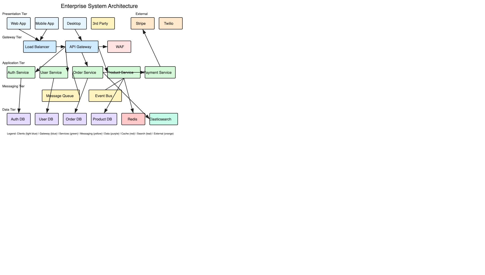

## Example Diagrams

The following diagram was created entirely with excalidraw-agent, demonstrating proper edge-to-edge connections using the `connect` command:

### Enterprise System Architecture

A multi-tier architecture showing clients, gateways, services, messaging, and data layers with 71 elements and proper connections.



**Key features demonstrated:**
- 5 architectural tiers (Presentation, Gateway, Application, Messaging, Data)
- 22 components with color-coded categories
- 19 connections using edge-to-edge calculation
- Named element IDs for programmatic connection

```bash
# Create components with IDs
excalidraw-agent add diagram.excalidraw \
  --type rectangle --x 50 --y 290 --width 120 --height 50 \
  --fill "#d3f9d8" --fill-style solid --label "Auth Service" --id auth-svc

# Connect using element IDs (calculates edge-to-edge automatically)
excalidraw-agent connect diagram.excalidraw --from api-gateway --to auth-svc
excalidraw-agent connect diagram.excalidraw --from auth-svc --to auth-db
```

See the [examples/diagrams](examples/diagrams) directory for source files.

## Specification
## Specification

This tool generates files conforming to the [Excalidraw file format](https://github.com/excalidraw/excalidraw/blob/master/packages/excalidraw/data/types.ts). Key specifications:

- **File Format**: JSON with `type: "excalidraw"` and `version: 2`
- **Element Types**: rectangle, ellipse, diamond, text, arrow, line, freedraw, image, frame
- **Properties**: Follows official [element type definitions](https://github.com/excalidraw/excalidraw/blob/master/packages/excalidraw/element/types.ts)

The `validate` command checks files against this specification:
```bash
excalidraw-agent validate diagram.excalidraw --strict
```

## File Compatibility

Output files are standard `.excalidraw` JSON files, compatible with:

- [excalidraw.com](https://excalidraw.com)
- Obsidian Excalidraw plugin
- VS Code Excalidraw extension
- Any tool supporting the Excalidraw format

## Development

```bash
# Clone
git clone https://github.com/karthikeyanjp/excalidraw-agent.git
cd excalidraw-agent

# Install dependencies
npm install

# Build
npm run build

# Run tests
npm test

# Run 100x stability test
npm run test:100
```

## Contributing

Contributions are welcome. Please see [CONTRIBUTING.md](CONTRIBUTING.md) for guidelines.

## License

MIT - see [LICENSE](LICENSE) for details.
