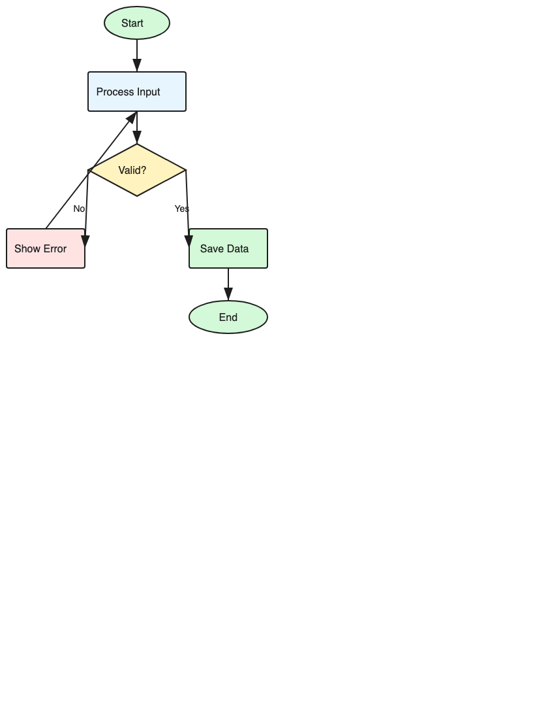
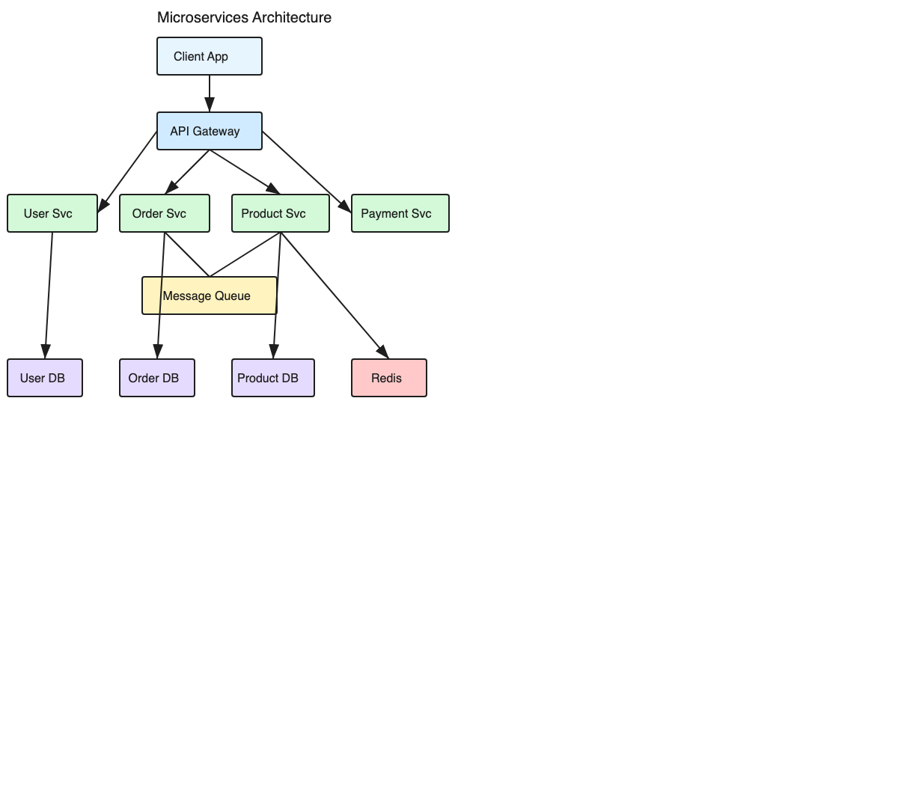
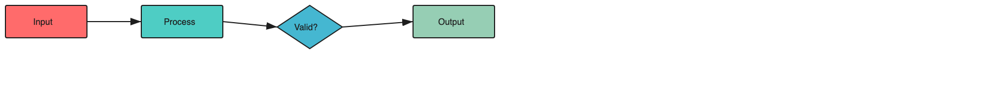

## Example Diagrams

All created with excalidraw-agent using the `connect` command for proper edge-to-edge arrows.

### Flowchart


### Microservices Architecture  


### Quick DSL
```bash
excalidraw-agent quick "[Input] -> [Process] -> {Valid?} -> [Output]" -o flow.excalidraw
```


See [examples/README.md](examples/README.md) for creation commands.


## Specification
## Specification
## Specification

This tool generates files conforming to the [Excalidraw file format](https://github.com/excalidraw/excalidraw/blob/master/packages/excalidraw/data/types.ts). Key specifications:

- **File Format**: JSON with `type: "excalidraw"` and `version: 2`
- **Element Types**: rectangle, ellipse, diamond, text, arrow, line, freedraw, image, frame
- **Properties**: Follows official [element type definitions](https://github.com/excalidraw/excalidraw/blob/master/packages/excalidraw/element/types.ts)

The `validate` command checks files against this specification:
```bash
excalidraw-agent validate diagram.excalidraw --strict
```

## File Compatibility

Output files are standard `.excalidraw` JSON files, compatible with:

- [excalidraw.com](https://excalidraw.com)
- Obsidian Excalidraw plugin
- VS Code Excalidraw extension
- Any tool supporting the Excalidraw format

## Development

```bash
# Clone
git clone https://github.com/karthikeyanjp/excalidraw-agent.git
cd excalidraw-agent

# Install dependencies
npm install

# Build
npm run build

# Run tests
npm test

# Run 100x stability test
npm run test:100
```

## Contributing

Contributions are welcome. Please see [CONTRIBUTING.md](CONTRIBUTING.md) for guidelines.

## License

MIT - see [LICENSE](LICENSE) for details.
